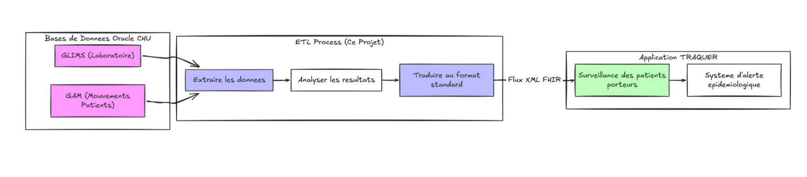
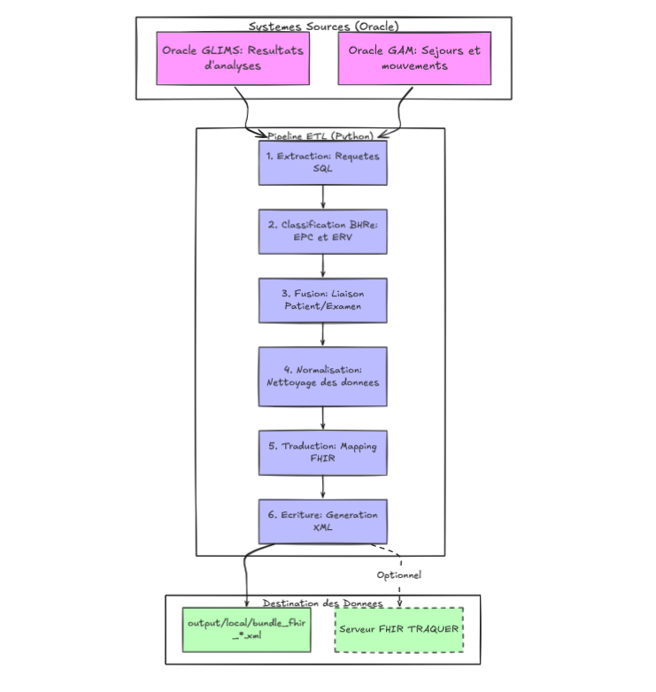

# TRAQUER ETL

Connecteur entre les systèmes d'information du CHU de Brest et l'application
TRAQUER, pour la surveillance des bactéries hautement résistantes aux antibiotiques.

Les deux surveillées
ici sont :

| Sigle | Signification | En clair |
|---|---|---|
| **EPC** | Entérobactérie productrice de carbapénémase | Bactérie intestinale qui détruit les antibiotiques de dernier recours |
| **ERV** | Entérocoque résistant à la vancomycine | Bactérie résistante à un antibiotique majeur |

Quand un patient porte une de ces bactéries, l'équipe d'hygiène hospitalière
doit le savoir vite, savoir où il se trouve, et savoir qui a pu être en contact
avec lui. C'est le rôle de l'application **TRAQUER**.

Mais TRAQUER ne sait pas lire directement les bases de l'hôpital. Ce projet est
le **traducteur** entre les deux.

### Ce que fait concrètement le connecteur



En trois phrases : le connecteur va chercher les résultats d'analyses au
laboratoire et les mouvements des patients dans l'hôpital, il détermine qui est
porteur d'une bactérie résistante, puis il transmet le tout dans un format
standardisé que TRAQUER comprend.

### Quelques termes utiles

| Terme | Explication |
|---|---|
| **ETL** | Extract, Transform, Load. Les trois temps de tout traitement de données : aller chercher, transformer, livrer. |
| **FHIR** | Norme internationale d'échange de données de santé. Elle définit un vocabulaire commun (Patient, Encounter, Observation...) que tous les logiciels de santé peuvent comprendre. |
| **GLIMS** | Le logiciel du laboratoire de microbiologie. |
| **GAM** | Gestion Administrative du Malade. Le logiciel qui enregistre les entrées, sorties et déplacements des patients. |
| **IPP** | Identifiant Permanent du Patient. Il ne change jamais. |
| **IEP** | Identifiant d'Épisode. Il identifie un séjour hospitalier. Un patient a un seul IPP, mais autant d'IEP que de séjours. |
| **Dossier** | Une demande d'analyse au laboratoire, identifiée par `ORD_INTERNALID`. |

---

## 2. Architecture

Le pipeline se déroule en six étapes, chacune confiée à un dossier du projet.




## 3. Les dossiers du projet

| Dossier | Rôle | Documentation |
|---|---|---|
| `extract/` | Va chercher les données dans Oracle | [docs/extract.md](docs/extract.md) |
| `transform/` | Détermine qui est porteur, prépare les données | [docs/transform.md](docs/transform.md) |
| `fhir_mapping/` | Traduit en vocabulaire FHIR | [docs/fhir_mapping.md](docs/fhir_mapping.md) |

Et à la racine, documentés dans [docs/racine.md](docs/racine.md) :

| Fichier | Rôle |
|---|---|
| `main.py` | Point d'entrée. Enchaîne les six étapes. |
| `config.py` | Paramètres et lecture des identifiants de connexion |
| `database.py` | Ouverture des connexions Oracle |
| `.env` | Identifiants et mots de passe. **Jamais versionné.** |

---

## 4. Installation

### Prérequis

Python 3.13, un accès réseau aux bases Oracle du CHU, et un compte de lecture
sur les schémas GLIMS et GAM.

### Mise en place

```bash
# 1. Récupérer le projet
git clone https://gitlab.chu-brest.fr/0173639A/traquer-etl
cd traquer-etl

# 2. Créer l'environnement et installer les dépendances
uv sync          # ou : python -m venv .venv && pip install -e .

```

Le fichier `.env` doit contenir :

```properties
# CONNEXION GLIMS
GLIMS_USER=xxx
GLIMS_PASSWORD=xxx
GLIMS_HOST=xxx
GLIMS_PORT=xxx
GLIMS_SERVICE=xxx

# CONNEXION GAM
GAM_USER=xxx
GAM_PASSWORD=xxx
GAM_HOST=xxx
GAM_PORT=xxx
GAM_SERVICE=xxx
```


## 5. Utilisation

### Lancer le pipeline

```bash
python main.py
```

Le résultat est écrit dans `output/local/bundle_fhir_AAAAMMJJ_HHMMSS.xml`.

Chaque étape affiche son avancement et ses volumes :

```
INFO - Etape 1/6 : extraction Oracle
INFO - Extraction terminee : GLIMS 2339 lignes, GAM 561 lignes
INFO - Etape 2/6 : transformation des sources
INFO - Transformation terminee : 18 dossiers, 561 mouvements
INFO - Etape 3/6 : fusion GAM x GLIMS par sejour
INFO - Etape 4/6 : normalisation vers le modele pivot
INFO - Pivot construit : patients 3, sejours 281, mouvements 561, ...
INFO - Etape 5/6 : construction du Bundle FHIR
INFO - Bundle construit : 393 ressources
INFO - Etape 6/6 : sauvegarde locale
INFO - Pipeline termine : output/local/bundle_fhir_20260722_150345.xml
```

Ces volumes ne sont pas décoratifs : ils permettent de repérer immédiatement à
quelle étape des données se perdent, sans relancer le traitement morceau par
morceau.


## 8. Contacts

Lansana CISSE, Ingenieur Data, 
CHU Brest |
lansana.cisse@chu-brest.fr