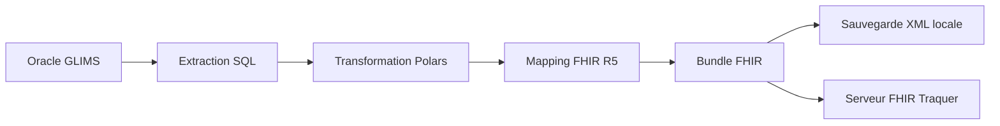
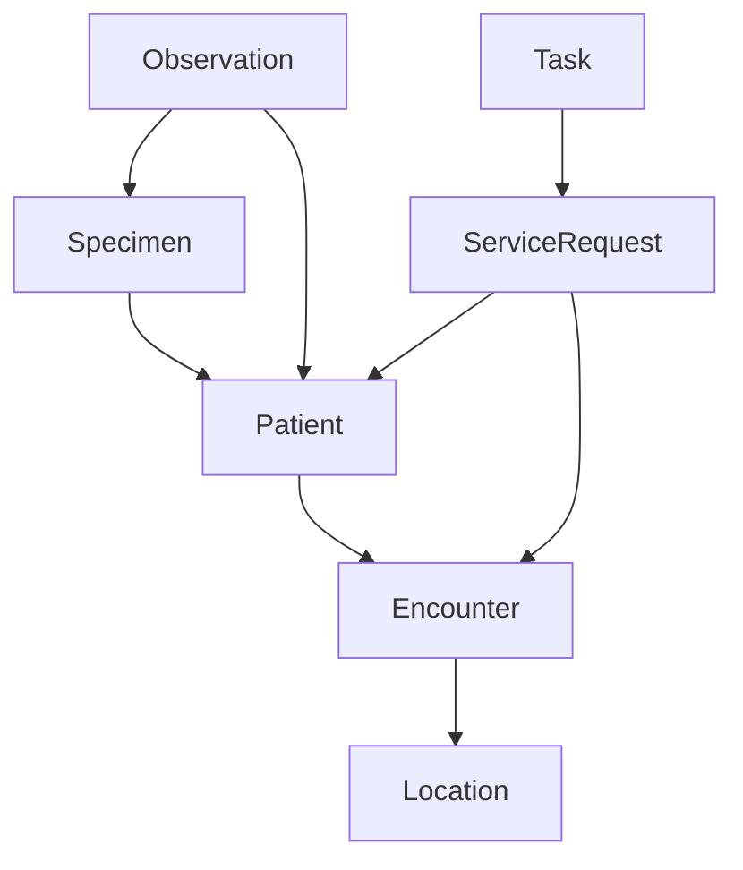

# Projet TRAQUER ETL FHIR R5

## 1. Présentation du projet

### 1.1 Objectif métier

Le projet a pour objectif de construire un pipeline ETL permettant l’extraction de données microbiologiques depuis GLIMS (laboratoire hospitalier), leur transformation métier, puis leur exposition au format HL7 FHIR R5 afin d’alimenter Traquer.

Le pipeline cible principalement la surveillance des bactéries multi-résistantes (BMR) et bactéries hautement résistantes émergentes (BHRe).

Le projet permet notamment :

* Le suivi des demandes microbiologiques
* Le suivi des prélèvements
* Le suivi des cultures et résultats d’antibiogramme
* L’exposition des données selon le modèle FHIR R5
* La transmission des données vers un serveur FHIR
* La génération de bundles XML FHIR

---

### 1.2 Cas d’usage

Le pipeline couvre les cas suivants :

| Cas d’usage              | Description                                            |
| ------------------------ | ------------------------------------------------------ |
| Surveillance BMR/BHRe    | Détection et transmission des résistances bactériennes |
| Suivi des prélèvements   | Suivi des demandes, prélèvements et résultats          |
| Alimentation Traquer     | Envoi des données hospitalières au format FHIR R5      |
| Historisation locale     | Sauvegarde locale des bundles XML                      |
| Intégration hospitalière | Interopérabilité FHIR avec système externe             |

---

### 1.3 Flux global



---

## 2. Architecture du projet

---

### 2.1 Structure réelle du projet

```text
glims-etl/
├── config.py
├── database.py
├── main.py
├── run_pipeline.py
├── sql_queries.py
├── pyproject.toml
├── README.md
├── uv.lock
│
├── extract/
│   ├── __init__.py
│   └── oracle_extract.py
│
├── transform/
│   ├── __init__.py
│   └── clean_data.py
│
├── fhir_mapping/
│   ├── __init__.py
│   ├── bundle.py
│   ├── utils.py
│   ├── location.py
│   ├── patient.py
│   ├── encounter.py
│   ├── service_request.py
│   ├── specimen.py
│   ├── observation.py
│   └── task.py
│
├── load/
│   ├── __init__.py
│   └── fhir_load.py
│
├── output/
│
├── transform/
│   └── clean_data.py
│
└── __marimo__/
```

---

### 2.2 Responsabilités des modules

| Module          | Responsabilité                   |
| --------------- | -------------------------------- |
| extract         | Extraction Oracle GLIMS          |
| transform       | Nettoyage et normalisation       |
| fhir_mapping    | Construction des ressources FHIR |
| load            | Sauvegarde et envoi              |
| sql_queries.py  | Centralisation des requêtes SQL  |
| database.py     | Connexion Oracle                 |
| config.py       | Paramètres applicatifs           |
| main.py         | Exécution locale développement   |
| run_pipeline.py | Exécution production / cron      |

---

## 3. Technologies détectées

### 3.1 Stack technique

| Technologie        | Usage                       |
| ------------------ | --------------------------- |
| Python 3.13        | Langage principal           |
| Polars             | Transformation de données   |
| Oracle Database    | Source de données           |
| HL7 FHIR R5        | Standard d’interopérabilité |
| fhir.resources 8.x | SDK FHIR R5                 |
| Requests           | Appels HTTP serveur FHIR    |
| Marimo             | Exploration interactive     |
| Cron Linux         | Orchestration batch         |
| uv                 | Gestion dépendances Python  |

---

### 3.2 Dépendances principales

| Dépendance     | Usage                        |
| -------------- | ---------------------------- |
| polars         | DataFrame et transformations |
| fhir.resources | Modèles FHIR R5              |
| requests       | Transmission HTTP            |
| zoneinfo       | Gestion fuseaux horaires     |

---

## 4. Source de données

### 4.1 Base Oracle GLIMS

Le projet extrait les données depuis Oracle GLIMS.

Les tables exploitées incluent notamment :

| Table            | Usage                |
| ---------------- | -------------------- |
| ORDER_           | Demandes laboratoire |
| ENCOUNTER        | Séjours              |
| PERSON           | Patients             |
| IDENTIFICATION   | IPP                  |
| RESULT           | Résultats            |
| SPECIMEN         | Prélèvements         |
| ISOLATION        | Cultures             |
| MICROORGANISM    | Bactéries            |
| ANTIBIOTICRESULT | Antibiogrammes       |
| ANTIBIOTIC       | Antibiotiques        |
| DEPARTMENT       | Département          |
| CORRESPONDENT    | UF                   |
| MATERIAL         | Type prélèvement     |
| ANTIBIOTICPANEL  | Panels antibiogramme |

---

### 4.2 Requête d’extraction

Le pipeline utilise une extraction optimisée basée sur un CTE.

Exemple simplifié :

```sql
WITH demandes AS (
    SELECT *
    FROM ORAGLIMS.ORDER_ o
    FETCH FIRST 10000 ROWS ONLY
)
SELECT
    idnt.IDNT_CODE,
    p.PRSN_INTERNALID,
    e.ENCT_EXTERNALID,
    o.ORD_ID,
    i.ISOL_ID,
    morg.MORG_NAME,
    ar.ABRS_RISREPORTVALUE
FROM demandes o
JOIN ORAGLIMS.ENCOUNTER e
    ON e.ENCT_ID = o.ORD_ENCOUNTER
LEFT JOIN ORAGLIMS.PERSON p
    ON e.ENCT_PERSON = p.PRSN_ID
```

---

## 5. Pipeline ETL

## 5.1 Extraction

L’extraction est réalisée dans :

```text
extract/oracle_extract.py
```

Fonctions principales :

* Connexion Oracle
* Exécution SQL
* Retour Polars DataFrame

---

## 5.2 Transformation

Les transformations sont centralisées dans :

```text
transform/clean_data.py
```

### Traitements réalisés

| Traitement                 | Description                          |
| -------------------------- | ------------------------------------ |
| Renommage colonnes         | Noms métiers français                |
| Conversion dates juliennes | Conversion timezone Europe/Paris     |
| Nettoyage IDs              | Compatibilité FHIR                   |
| Mapping sexe               | M/F/Autres                           |
| Mapping sensibilité        | Sensible / Intermédiaire / Résistant |
| Mapping statuts            | Demandes et résultats                |

---

### Conversion des dates

Les dates GLIMS sont converties via une fonction spécifique.

Exemple :

```python
from zoneinfo import ZoneInfo
from datetime import datetime
```

Colonnes converties :

* date_debut_sejour
* date_fin_sejour
* date_prelevement
* date_prescription
* date_reception
* date_validation
* date_reception_prelevement
* date_disponibilite_isolation
* date_validation_isolation
* date_confirmation_isolation
* date_disponibilite_atb

---

## 5.3 Mapping FHIR R5

Le mapping FHIR est implémenté dans :

```text
fhir_mapping/
```

---

### Ressources FHIR implémentées

| Ressource      | Fichier            |
| -------------- | ------------------ |
| Patient        | patient.py         |
| Encounter      | encounter.py       |
| Location       | location.py        |
| ServiceRequest | service_request.py |
| Specimen       | specimen.py        |
| Observation    | observation.py     |
| Task           | task.py            |
| Bundle         | bundle.py          |


---

### Architecture FHIR



---

### Gestion des Locations

Le modèle retenu est :

```text
Département
    └── UF
```

Avec utilisation de :

```text
Location.partOf
```

---

### Gestion des statuts Task

Le pipeline génère les statuts suivants :

| Statut      | Signification        |
| ----------- | -------------------- |
| requested   | Demande créée        |
| in-progress | Prélèvement effectué |
| completed   | Résultat disponible  |

---

## 5.4 Construction du Bundle

Le bundle FHIR utilise :

```text
Bundle.type = transaction
```

Les entrées utilisent :

```text
HTTP PUT
```

afin de garantir l’idempotence.

Exemple :

```python
BundleEntryRequest(
    method="PUT",
    url=f"{resource_type}/{resource.id}",
)
```

---

## 5.5 Chargement

Le chargement est implémenté dans :

```text
load/fhir_load.py
```

Fonctions présentes :

| Fonction              | Description             |
| --------------------- | ----------------------- |
| save_bundle_local     | Sauvegarde XML locale   |
| send_bundle_to_server | Envoi HTTP serveur FHIR |

---

## 6. Exécution du projet

### 6.1 Exécution développement

```bash
python main.py
```

Fonctionnement :

```text
Extraction
→ Transformation
→ Construction bundle
→ Sauvegarde XML locale
```

---

### 6.2 Exécution production

```bash
python run_pipeline.py
```

Fonctionnement :

```text
Extraction incrémentale
→ Transformation
→ Bundle FHIR
→ Sauvegarde locale
→ Envoi serveur FHIR
→ Mise à jour watermark
```

---

## 7. Orchestration

### 7.1 Cron Linux

Le projet utilise un cron Linux classique.

Exemple :

```cron
*/5 * * * * cd /mnt/san/cdc/0173639A/glims-etl && .venv/bin/python run_pipeline.py >> logs/cron.log 2>&1
```

---

### 7.2 Monitoring

Le monitoring actuel repose sur :

| Élément            | Usage                |
| ------------------ | -------------------- |
| logs/cron.log      | Logs d’exécution     |
| state/last_run.txt | Watermark extraction |
| output/local       | Bundles XML          |

---

## 8. Gestion des données

### 8.1 Modèle métier

Le pipeline manipule les concepts suivants :

| Concept       | Description              |
| ------------- | ------------------------ |
| Patient       | Identité patient         |
| Séjour        | Hospitalisation          |
| Demande       | Prescription laboratoire |
| Prélèvement   | Échantillon biologique   |
| Isolation     | Culture bactérienne      |
| Antibiogramme | Résistance bactérienne   |

---

### 8.2 Mapping métier

| Champ GLIMS         | Champ métier   |
| ------------------- | -------------- |
| IDNT_CODE           | ipp            |
| ENCT_EXTERNALID     | iep            |
| PRSN_LASTNAME       | nom            |
| PRSN_FIRSTNAME      | prenom         |
| ABRS_RISREPORTVALUE | sensibilite    |
| MORG_NAME           | microorganisme |
| AB_NAME             | antibiotique   |

---

## 9. Gestion des erreurs

### Mécanismes présents

| Mécanisme          | Description          |
| ------------------ | -------------------- |
| Validation FHIR    | Validation Pydantic  |
| Nettoyage IDs      | Compatibilité FHIR   |
| Conversion dates   | Sécurisation formats |
| PUT transactionnel | Idempotence          |
| Logs               | Traçabilité          |

---

## 10. Sécurité

### Gestion des secrets

Les paramètres sensibles sont prévus via variables d’environnement.

Variables identifiées :

| Variable        | Usage                    |
| --------------- | ------------------------ |
| FHIR_SERVER_URL | URL serveur FHIR         |
| FHIR_TOKEN      | Authentification serveur |

---


## 11. Formats manipulés

| Format           | Usage             |
| ---------------- | ----------------- |
| SQL              | Extraction Oracle |
| DataFrame Polars | Transformation    |
| XML FHIR         | Export final      |
| HTTP FHIR        | Transmission      |

---

## 12. Convention de nommage

### Colonnes

Les colonnes sont normalisées :

* minuscules
* noms métiers français
* snake_case

Exemple :

| Source              | Cible             |
| ------------------- | ----------------- |
| PRSN_BIRTHDATE      | date_naissance    |
| ENCT_STARTTIME      | date_debut_sejour |
| ABRS_RISREPORTVALUE | code_sensibilite  |

---

## 13. Dépendances FHIR

### SDK utilisé

```text
fhir.resources 8.x
```

### Version cible

```text
FHIR R5
```

---

## 14. Tests

Aucun framework de test automatisé n’a été détecté dans le projet.

Les validations actuelles reposent principalement sur :

* validation Pydantic FHIR
* exécution locale via main.py
* validation XML généré

---


## 15. Contact

Lansana CISSE
Data Scientist
TRAQUER 
lansana.cisse@chu-brest.fr
