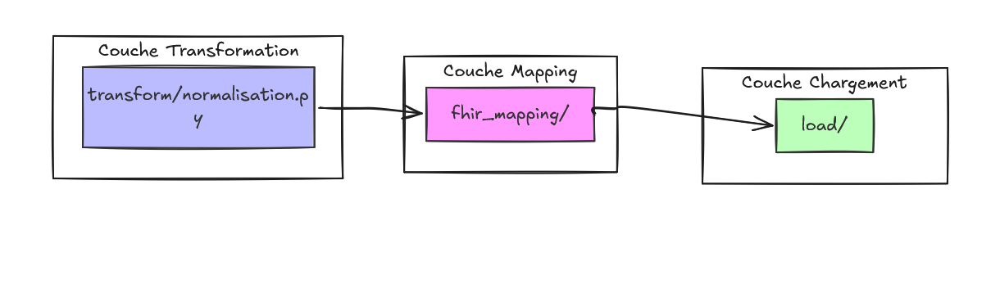

# `fhir_mapping/`

Traduit les données préparées par `transform/` en **FHIR**, la norme
internationale d'échange en santé. C'est ce qui permet à TRAQUER de comprendre
les données du CHU sans rien connaître de GLIMS ni du GAM.

## FHIR en bref

FHIR décrit la santé avec un vocabulaire fixe. Chaque notion est une
**ressource** :

| Ressource | Ce qu'elle représente ici |
|---|---|
| `Patient` | Nom, naissance, sexe |
| `Encounter` | Un séjour, avec les unités traversées |
| `Location` | Une unité de soins, ou le service demandeur |
| `ServiceRequest` | Une demande d'analyse |
| `Specimen` | Un prélèvement |
| `Observation` | Le résultat : porteur ou non |
| `Task` | Le suivi d'une demande en cours |

Ces ressources sont regroupées dans un **Bundle**, exporté en XML.

## Organisation

```
fhir_mapping/
├── utils.py             # identifiants, dates, références
├── patient.py           # une ligne patient → Patient
├── location.py          # une unité        → Location
├── encounter.py         # un séjour        → Encounter
├── service_request.py   # un dossier       → ServiceRequest
├── specimen.py          # un prélèvement   → Specimen
├── observation.py       # un résultat      → Observation
├── task.py              # un suivi         → Task
└── bundle.py            # assemble le tout
```

Un fichier par ressource, chacun exposant une fonction `map_*`. Ces fonctions ne
font que traduire : `transform/` a déjà fait le travail de préparation.

## Liens entre ressources

| Ressource | Identifiant |
|---|---|
| Patient | `patient-{IPP}` |
| Encounter | `encounter-{IEP}` |
| Location | `location-{code unité}` |
| ServiceRequest / Observation | `servicerequest-{dossier}` / `observation-{dossier}` |
| Specimen | `specimen-{prélèvement}` |

Les liens utilisent la forme `urn:uuid:patient-167825`, ce qui rend le Bundle
auto-suffisant : chaque référence trouve sa cible dans le fichier.


## Terminologie

Les champs décrivant la nature d'un examen ou d'un résultat sont transmis en
**texte libre**, sans code imposé. Le logiciel receveur applique sa propre
terminologie. Seuls deux codes standards HL7 sont utilisés, car la structure
FHIR les exige : type de rencontre et type de lieu.

## Interactions


