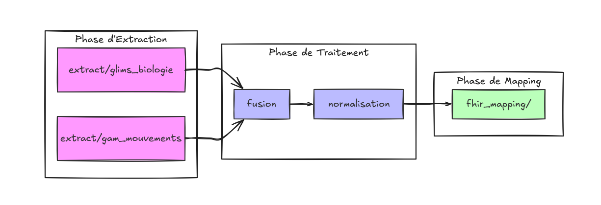

# `transform/`

Cœur métier : détermine si un patient est porteur (EPC/ERV/négatif/en attente).

## Organisation

```
transform/
├── glims_biologie.py     # étape 2a : qui est porteur ?
├── gam_mouvements.py     # étape 2b : où est le patient ?
├── fusion_gam_glims.py   # étape 3 : rapprochement
├── normalisation.py      # étape 4a : traduction GLIMS/GAM → noms standards
└── pivot.py              # étape 4b : construction des six tables (générique)
```

Les quatre premiers sont propres au CHU de Brest. `pivot.py` ne connaît ni
GLIMS ni le GAM : seul fichier réutilisable tel quel par un autre
établissement, s'il fournit un DataFrame aux noms standards (voir
`Fiche_format_connecteur.md`).

---

## `glims_biologie.py`

Lit les résultats en texte libre (« Présence de... », « Absence de... ») pour
classer chaque dossier.

`STATUT_SURVEILLANCE` : `EPC` / `ERV` / `EPC+ERV` / `NEGATIF` /
`RESULTAT_NON_DISPONIBLE`.

`STATUT_RESULTAT` : `requested` / `in-progress` / `done`.

`consolider()` réduit à une ligne par dossier, priorité :
`EPC+ERV > EPC > ERV > NEGATIF > RESULTAT_NON_DISPONIBLE`.

---

## `gam_mouvements.py`

Calcule le statut du séjour, déjà en codes FHIR : `planned` / `in-progress` /
`completed`.

---

## `fusion_gam_glims.py`

Relie analyses et séjours par l'**IEP**.

---

## `normalisation.py` (spécifique à Brest)

Renomme les colonnes GLIMS/GAM vers les noms standards. Aucun parsing, aucune
agrégation.

| Fonction | Rôle |
|---|---|
| `standardiser(df)` | Renommage vers les noms standards |
| `normaliser(df)` | `standardiser()` + `pivot.construire_pivot()` |

À réécrire, avec les requêtes SQL et les règles de détection, pour un autre
système source.

---

## `pivot.py` (générique)

Découpe un DataFrame **déjà standardisé** en six tables (une ligne par
entité) : `patients`, `sejours`, `mouvements`, `unites`, `dossiers`,
`prelevements`. Applique fuseau Europe/Paris, neutralisation de la sentinelle
`4712-12-31`, première valeur non nulle par entité.

Point d'entrée : `construire_pivot(df)`, appelable directement par un
établissement tiers sur son propre DataFrame standardisé.

---

## Interactions

